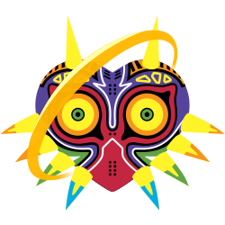

# mme - Majora's Mask Explorer

## Usage
1. `./mme ROM`
2. http://localhost:8064

URIs and ports are hardcoded for now.

## Requirements
1. Golang
2. NodeJS+yarn
3. `go get github.com/gobuffalo/packr/packr`
4. `go get`
5. `yarn global add @vue/cli`
6. `cd front && yarn install`

## Development
A file named `rom.z64` is required at the repository root.

1. Run the front dev server: `cd front && yarn serve`
2. Run the back dev server: `make run`
3. Open your browser to http://localhost:8080

## Production
1. `make release`
